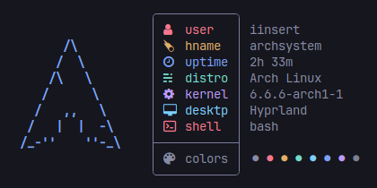

<br />
<div align="center">
  <a href="https://github.com/iinsertNameHere/Catnip">
    
  </a>

<h3 align="center"><code>Catnip🌿</code> Systemfetch</h3>
  <p align="center">
    <a href="#-demo-image">View Demo</a>
    ·
    <a href="#-compilationinstallation-linux">Linux Installation</a>
    ·
    <a href="#-compilationinstallation-windows">Windows Installation</a>
  </p>
</div>
<br>

## 🌿 What is Catnip
I created `Catnip🌿` as a playful, simple system-information **concatenation** tool using `nim👑`. It is quite **customizable** and has possibilities to alter the names and colors of the statistics. In the future, I also intend to add more distribution logos. Feel free to contribute to the project at any time.

> #### ⏱️ Execution Time 
> *Around **0.009** seconds on my laptop*

### 📊 Displayed Statistics
- username
- hostname
- system uptime
- running os
- running kernel
- desktop env
- used shell
- terminal colors

## 📷 Demo Image
>**NOTE:** Design was inspired by <code><a href="https://github.com/ssleert/nitch">Nitch</a></code>

> 

## 💻 Usage
Run catnip in you terminal:
```bash
./catnip
```

Change the distro icon using:
```bash
./catnip [distroname]
```

## 🪡 Installation/Build

### 📦 On Linux
**1.** Install <a href="https://nim-lang.org/install.html">`nim👑`</a>

**2.** Clone the repo:
```bash
git clone https://github.com/iinsertNameHere/Catnip.git
```
**3.** Change dir into the repo
```bash
cd ./Catnip/src
```

**4.** Copy config to ~/.config:
```bash
cp ../config.toml ~/.catnip/config.toml
```

**5.** Run `nim👑` compilation:
```bash
nim c -d:release catnip.nim
```

**6.** You can now use the compiled file:
```bash
./catnip
```

---

### 📦 On Windows
**1.** Install <a href="https://nim-lang.org/install.html">`nim👑`</a>

**2.** Clone the repo:
```powershell
wget "https://codeload.github.com/iinsertNameHere/Catnip/zip/refs/heads/main" -outfile "Catnip.zip" 
```

**3.** Expand zipfile
```powershell
Expand-Archive -Path "Catnip.zip"
```

**4.** Change dir into the repo
```powershell
cd ".\Catnip\Catnip-main\src"
```

**5.** Copy config to home dir:
```powershell
cp "..\config.toml" "C:\Users\$env:username\.catnip\config.toml"
```

**6.** Run `nim👑` compilation:
```powershell
nim c -d:release catnip.nim
```

**7.** You can now use the compiled file:
```powershell
.\catnip.exe
```

> **NOTE:** For the icons to work, make sure you set a [NerdFont](https://www.nerdfonts.com/) as you terminal font.

## 📒Configuration
The `stats` node is located in the config file (`.catnip/config.toml`).
You can change the names, colors, and icons for the various stats inside the `stats` node.

*Example config that dose not use NerdFont icons:* 
```toml
##############################################
##          FetchInfo stats Config          ##
##############################################
[stats]
username = {icon = ">", name = "user", color = "(RD)"}
hostname = {icon = ">", name = "hname", color = "(YW)"}
uptime   = {icon = ">", name = "uptime", color = "(BE)"}
distro   = {icon = ">", name = "distro", color = "(GN)"}
kernel   = {icon = ">", name = "kernel", color = "(MA)"}
desktop  = {icon = ">", name = "desktp", color = "(CN)"}
shell    = {icon = ">", name = "shell", color = "(RD)"}
colors   = {icon = ">", name = "colors", color = "!DT!", symbol = "#"}
```

### 🎨 Colors:
Catnip's color system uses a ColorId, witch is made up of the colors first and last letter, enclosed in characters that indicate the type of color.

**Color Types:**
- Forground Normal  -> `(#)`
- Forground Bright  -> `{#}`
- Background Normal -> `[#]`
- Background Bright -> `<#>`

>**NOTE:** `#` Should be replaced by the color id.

**Color IDs:**
- BLACK   -> `BK`
- RED     -> `RD`
- GREEN   -> `GN`
- YELLOW  -> `YW`
- BLUE    -> `BE`
- MAGENTA -> `MA`
- CYAN    -> `CN`
- WHITE   -> `WE`

So `{GN}` translates to: Forground-Bright-Green.
To set the color to Default, use `!DT!`.

## 🗃️ Todos
- [ ] Add more Distro logos
- [X] Add config options for icons
- [X] Add more config options for colors
- [X] Make `Catnip🌿` crossplatform
- [ ] Add config options for layout
