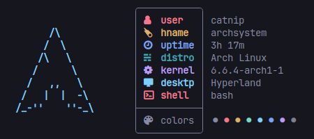

# Catnip System-fetch


---

I created Catnip as a playful, simple system-information **concatenation** tool in **nim**. It is quite **customizable** and has possibilities to alter the names and colors of the statistics. In the future, I also intend to add more distribution logos. Feel free to contribute to the project at any time.

### Displayed Statistics
- username
- hostname
- system uptime
- running os
- running kernel
- desktop env
- used shell
- terminal colors

**NOTE:** Design was inspired by [Nitch](https://github.com/ssleert/nitch)

## Usage
Run catnip in you terminal:
```bash
./catnip
```

Change the distro icon using:
```bash
./catnip [distroname]
```


## Compilation/Installation
Install nim with you favorit pkg manager:
```bash
sudo yay -S nim
```

Clone the repo:
```bash
git clone https://github.com/iinsertNameHere/Catnip.git
cd ./Catnip/src
```

Run nim compilation:
```bash
nim c -d:release catnip.nim
```

Copy config:
```bash
cp ../catnip.json ~/.config/catnip.json
```