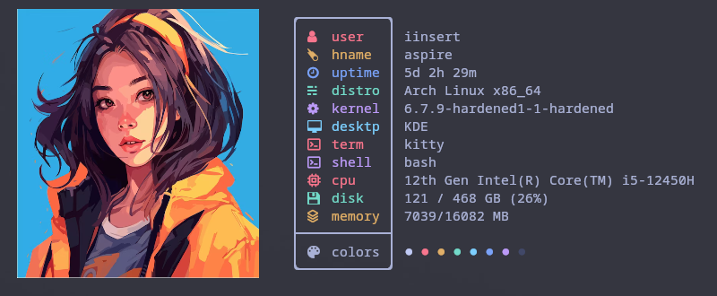
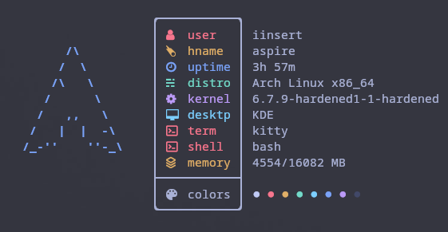
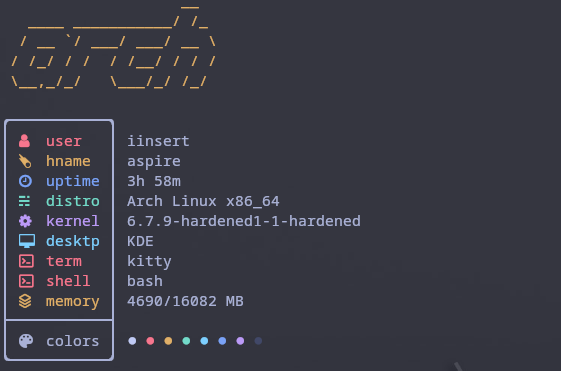
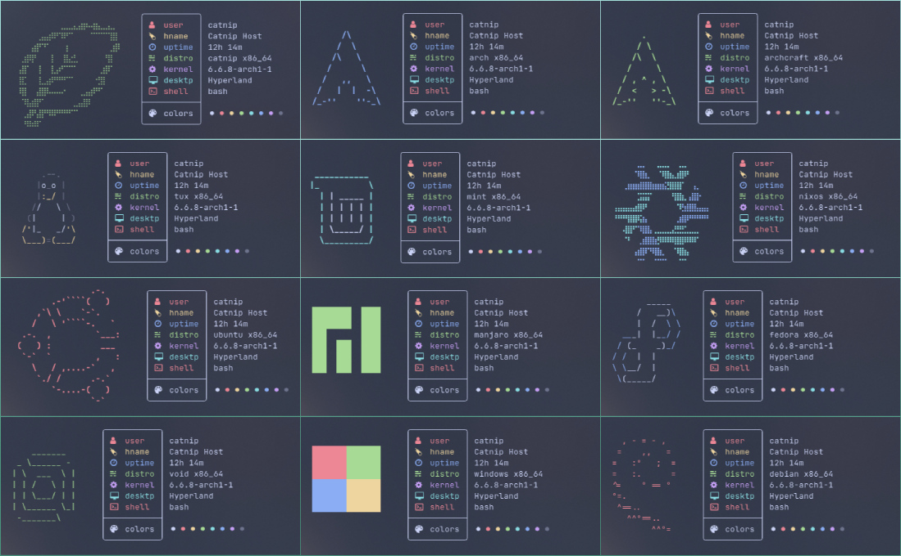
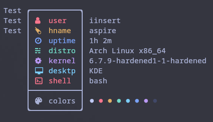
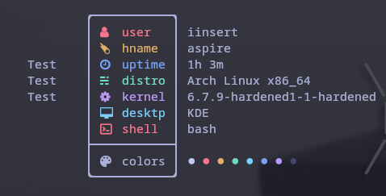

<br />
<div align="center">
  <a href="https://github.com/iinsertNameHere/catnip">
    <center></center>
  </a>

<h1 align="center"><code>Catnip🌿</code> Systemfetch</h3>
  <p align="center">
    <a href="#-demo-image">View Demo</a>
    ·
    <a href="#-installationbuild">Installation</a>
    ·
    <a href="#-usage">Basic Usage</a>
    ·
    <a href="#-configuration">Configuration</a>
    ·
    <a href="#thanks-to-all-contributors-">Contributors</a>
  </p>
</div>
<br>


## 🌿 What is Catnip
I created `Catnip🌿` as a playful, simple system-information **concatenation** tool using `nim👑`. It is quite **customizable** and has possibilities to alter the names and colors of the statistics. In the future, I also intend to add more distribution logos. Feel free to contribute to the project at any time.

> #### ⏱️ Execution Time 
> *Around **0.006** seconds on my laptop

#### 📊 Displayed Statistics
<details>
  <summary style="font-size: 18px; font-weight: 600;">View Statistics</summary>
  <ul>
    <li>username</li>
    <li>hostname</li>
    <li>uptime</li>
    <li>os</li>
    <li>kernel</li>
    <li>desktop</li>
    <li>shell</li>
    <li>terminal</li>
    <li>memory</li>
    <li>disk space</li>
    <li>colors</li>
  </ul>
</details>

#### ❤ Shoutout to:
- [NimParsers/parsetoml](https://github.com/NimParsers/parsetoml) for the toml parsing
- [ssleert/Nitch](https://github.com/ssleert/nitch) for the inspiration
- [All contributors](#thanks-to-all-contributors-)

**Feel free to submit [issues](https://github.com/iinsertNameHere/catnip/issues) if you have any improvement ideas! ❤**

<br>

## 📷 Demo Images
<details>
  <summary style="font-size: 18px; font-weight: 600;">Demo Images ✨</summary>

<i>Default:</i>
<br>

<br>
<i>FigletLogos (<a href="https://github.com/ssleert/nitch">Nitch</a> mode):</i>
<br>

<br>
<i>Image Mode:</i>
<br>

<br>
<i>Distro Showcase:</i>
<br>


<br>
</details>

## 🪡 Installation/Build
**1.** Install <a href="https://nim-lang.org/install.html">`nim👑`</a> and all dependencies

>#### Dependencies:
>- pcre
>- gzip
>#### Optional:
>- figlet (required for figletLogos)
>- [viu](https://github.com/atanunq/viu) (required for imageMode)

**2.** Clone the repo:
```shell
git clone https://github.com/iinsertNameHere/catnip.git
```

**3.** Change dir to repo
```shell
cd ./catnip
```

**4.** Run install using `nim👑`:
```shell
nim install
```

> **NOTE:** For the icons to work, make sure you set a [NerdFont](https://www.nerdfonts.com/) as you terminal font.

<br>

## 💻 Usage
Run catnip in you terminal:
```bash
$ catnip
```

Change the distro icon using:
```bash
$ catnip -d <distro>
```

To get a full list of arguments use:
```bash
$ catnip --help
```

<br>

## 📒 Configuration
> **The config files are located at:**
> -  `~/.config/catnip`

<br>

You can change the names, colors, and icons for the various stats inside the `stats` section of the `config.toml` file.

*Example `stats` section that does not use NerdFont icons:* 
```toml
##############################################
##          FetchInfo stats Config          ##
##############################################
[stats]
username = {icon = ">", name = "user", color = "(RD)"}
hostname = {icon = ">", name = "hname", color = "(YW)"}
uptime   = {icon = ">", name = "uptime", color = "(BE)"}
distro   = {icon = ">", name = "distro", color = "(GN)"}
kernel   = {icon = ">", name = "kernel", color = "(MA)"}
desktop  = {icon = ">", name = "desktp", color = "(CN)"}
shell    = {icon = ">", name = "shell", color = "(RD)"}
colors   = {icon = ">", name = "colors", color = "!DT!", symbol = "#"}
```

*If you don't want to display a stat, you can just comment out the line:*
```toml
##############################################
##          FetchInfo stats Config          ##
##############################################
[stats]
username = {icon = ">", name = "user", color = "(RD)"}
hostname = {icon = ">", name = "hname", color = "(YW)"}
uptime   = {icon = ">", name = "uptime", color = "(BE)"}
distro   = {icon = ">", name = "distro", color = "(GN)"}
kernel   = {icon = ">", name = "kernel", color = "(MA)"}
# desktop  = {icon = ">", name = "desktp", color = "(CN)"}
# shell    = {icon = ">", name = "shell", color = "(RD)"}
colors   = {icon = ">", name = "colors", color = "!DT!", symbol = "#"}
``` 

*You can change the order in which the stats are displayed by just changing the order in the config:*
```toml
##############################################
##          FetchInfo stats Config          ##
##############################################
[stats]
uptime   = {icon = ">", name = "uptime", color = "(BE)"}
distro   = {icon = ">", name = "distro", color = "(GN)"}
kernel   = {icon = ">", name = "kernel", color = "(MA)"}
desktop  = {icon = ">", name = "desktp", color = "(CN)"}
shell    = {icon = ">", name = "shell", color = "(RD)"}
username = {icon = ">", name = "user", color = "(RD)"} # Username is now on the bottom
hostname = {icon = ">", name = "hname", color = "(YW)"} # Hostname is now on the bottom
colors   = {icon = ">", name = "colors", color = "!DT!", symbol = "#"}
``` 

### 🎨 Colors:
Catnip's color system uses a ColorId, which is made up of the colors first and last letter, enclosed in characters that indicate the type of color.

**Color Types:**
- Foreground Normal  -> `(#)`
- Foreground Bright  -> `{#}`
- Background Normal -> `[#]`
- Background Bright -> `<#>`

>**NOTE:** `#` Should be replaced by the color id.

**Color IDs:**
- BLACK   -> `BK`
- RED     -> `RD`
- GREEN   -> `GN`
- YELLOW  -> `YW`
- BLUE    -> `BE`
- MAGENTA -> `MA`
- CYAN    -> `CN`
- WHITE   -> `WE`

So `{GN}` translates to: Foreground-Bright-Green.
To set the color to Default, use `!DT!`.

### 🚩 Misc
In the `misc` section of `config.toml` you can find 3 keys.
1. `layout`
2. `figletLogos`
3. `imageMode`

#### Layout
In the layout you can define how the logo and stats will be arranged.
- Use `Inline` to place the logo and stats next to each other.
- Use `ArtOnTop` to place the logo on top of the stats.
- Use `StatsOnTop` to place the stats on top of the logo.

#### Figlet Logos
In the `figletLogos` section you can find 4 keys:
1. `enable`
2. `color`
3. `font`
4. `margin`

- Set `enable` to `true`/`false` to enable or disable *figlet* generated logos.
- Use `color` to set the color the *figlet* logos should have.
- Use `font` to set what font *figlet* should use.
- Use `margin` to define the margins of the *figlet* logos.

#### Image Mode
In the `imageMode` section you can find 4 keys:
1. `enable`
2. `path`
3. `scale`
4. `margin`

- Set `enable` to `true`/`false` to enable or disable *image mode*.
- Use `path` to define what image file to display.
- Use `scale` to set the scale of the image.
- Use `margin` to define the logo margins.

### 🖌️ Distro Art
To create a new DistroArt object inside the `distros.toml` file, add a new section to the file (replace `distroname` with the name of your distro):
```toml
[distroname]
```

Catnip's DistroArt Objects have three possible keys.
1. `margin`
2. `art`
3. `alias`

#### Margin
The `margin` key is used to define the top, left and right margins of the art. For example:

> *Art with `margin = [0, 0, 0]`*


> *Art with `margin = [3, 3, 3]`*


#### Art
The `art` key is used to define the ascii-art for your distro.
For example:
```
art = [
  "Test",
  "Test",
  "Test"
]
```

#### Alias
The `alias` key can be used to define alternate names that should also refer to the DistroArt Object.

*Example in which 'test1' also refers to your new DistroArt object:*
```
alias = "test1"
```

This is also used to define the `default` DistroArt object, which defines what art should be displayed by default.

---

*Example DistroArt object:*
```
[distroart.test]
alias = "test1"
margin = [3, 3 ,3]
art = [
  "Test",
  "Test",
  "Test"
]
```

<br>
<br>

# Thanks to all contributors ❤

<a href = "https://github.com/iinsertNameHere/catnip/graphs/contributors">
   
</a>
