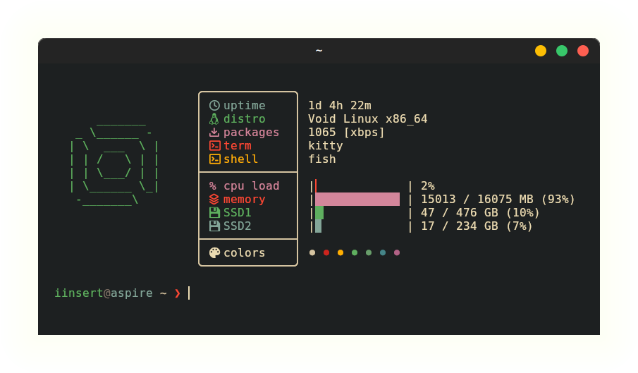

<br />
<div align="center">
  <a href="https://github.com/iinsertNameHere/catnap">
    <center></center>
  </a>

<h1 align="center"><code>Catnap🌿</code> Systemfetch</h1>
  <p align="center">
    <a href="#-demo-images">View Demo</a>
    ·
    <a href="#-documentation">Documentation</a>
    ·
    <a href="#-contributing">Contributing</a>
  </p>
  <p align="center">
    <a href="https://github.com/iinsertNameHere/catnap/actions/workflows/test-catnap.yml">
      
  </p>
</div>
<br>

## 🌿 What is Catnap
I created `Catnap🌿` (originally known as `Catnip`) as a playful, simple system-information **concatenation** tool using `nim👑`. It is quite **customizable** and has possibilities to alter the names and colors of the statistics. In the future, I also intend to add more distribution logos. Feel free to contribute to the project at any time.

> #### ⏱️ Execution Time 
> Around **0.008** seconds on my laptop

#### 📊 Displayed Statistics
<details>
  <summary style="font-size: 18px; font-weight: 600;">View Statistics</summary>
  <ul>
    <li>username</li>
    <li>hostname</li>
    <li>uptime</li>
    <li>os</li>
    <li>kernel</li>
    <li>desktop</li>
    <li>shell</li>
    <li>terminal</li>
    <li>memory</li>
    <li>battery</li>
    <li>disk space</li>
    <li>cpu info</li>
    <li>packages</li>
    <li>weather</li>
    <li>colors</li>
  </ul>
</details>

#### ❤️ Shoutout to:
- [ssleert/Nitch](https://github.com/ssleert/nitch) for the inspiration
- [All contributors](#thanks-to-all-contributors-)

**Feel free to submit [issues](https://github.com/iinsertNameHere/catnap/issues) if you have any improvement ideas! ❤**

<br>

## 📷 Demo Images
<details>
  <summary style="font-size: 18px; font-weight: 600;">Demo Images ✨</summary>

<i>Example: </i>
<br>

<br>
</details>

<br>

## 📒 Documentation
You can read the full documentation [here](https://iinsertnamehere.github.io/catnap-docs/)
<br>
It covers installation, usage and configuration!

> If you think something is missing, feel free to open a Issue in the [catnap-docs](https://github.com/iinsertNameHere/catnap-docs) repository.

<br>

## 🧪 Testing
To test catnap, run the following commands in the catnap repo:
```bash
$ nim debug
$ ./scripts/test-commandline-args.sh
$ ./scripts/test-bad-configs.sh
```

<br>

## 🐛 Bugs
If you've found a bug, please follow the steps below:
1. Make sure you're on the latest commit, as bugs that are in your current version might've been fixed in later commits.
2. Run `catnap -v` and copy the output into your clipboard.
3. Create an issue and remember to click on the bug report template!
4. Fill in the details and submit the report.

<br>

## 🔨 Contributing
For more info on how to contribute and how to add a new distro, see [CONTRIBUTING.md](CONTRIBUTING.md).

<br>

## ❤️ Thanks to all contributors!

<p align="center">
  <a href = "https://github.com/iinsertNameHere/catnap/graphs/contributors">
     
  </a>
</p>

<br>
<br>


<p align="center">
    
</p>
